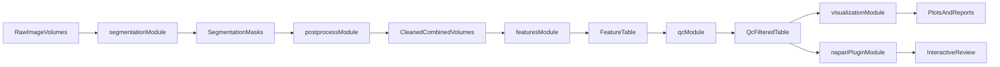

# Modularize CMAP As Sibling Modules

## Goals

- Keep `segmentation/` focused: **raw image input -> segmentation masks output only**.
- Make `postprocess/`, `features/`, `qc/`, and `napari-plugin/` sibling modules under `cmap/`.
- Improve long-term extensibility so each step can evolve independently.
- Preserve current behavior via compatibility entrypoints during migration.

## Target Layout Under `cmap/`

- `cmap/segmentation/`
  - preprocess + 2D segmentation + 3D assembly
  - contract: input raw volumes, output 3D mask artifacts
- `cmap/postprocess/`
  - mask filtering/combination logic
  - contract: input segmentation masks (+ selected channels), output filtered mask products
- `cmap/features/`
  - cell boxing + per-cell feature extraction
  - contract: input filtered/combined volumes, output feature tables
- `cmap/qc/`
  - thresholding, pass/fail tagging, QC reports
  - contract: input feature tables, output filtered feature tables and QC decisions
- `cmap/visualization/`
  - t-SNE/UMAP plots and analysis renderers
- `cmap/napari-plugin/`
  - viewer and interactive exploration layer
- `cmap/pipelines/`
  - orchestrators that wire modules without owning module logic
- `cmap/shared/`
  - shared config, logging, IO contracts
- `cmap/scripts/`
  - SLURM/LSF wrappers only
- `cmap/legacy/`
  - old folder variants and one-off historical reruns

## Current Code Mapping (Old -> New Module)

- `segmentation_multiscale_cellpose_3D/preprocessing/*` -> `cmap/segmentation/preprocess/`
- `segmentation_multiscale_cellpose_3D/multiscale_cellpose/*` -> `cmap/segmentation/cellpose2d/`
- `segmentation_multiscale_cellpose_3D/cellcomposor/*` -> `cmap/segmentation/assemble3d/`
- `segmentation_multiscale_cellpose_3D/postprocessing/*` -> `cmap/postprocess/`
- `segmentation_multiscale_cellpose_3D/cell_boxing/*` -> `cmap/features/cell_boxing/`
- `segmentation_multiscale_cellpose_3D/cell_qc/extract_features.py` -> `cmap/features/extract_features/`
- `segmentation_multiscale_cellpose_3D/cell_qc/filter_by_intensity.py` -> `cmap/qc/filter_by_intensity/`
- `segmentation_multiscale_cellpose_3D/cell_qc/tsne_visualize*.py` -> `cmap/visualization/embedding/`

## Module Interface Contracts

- `segmentation`: consumes raw volumes; produces mask artifacts only.
- `postprocess`: consumes masks + aligned intensity channels; produces cleaned/combined volumes.
- `features`: consumes cleaned/combined volumes; produces feature CSV/parquet.
- `qc`: consumes feature tables; produces pass/fail labels and filtered tables.
- `visualization`/`napari-plugin`: consume outputs from upstream modules; no back-coupled writes into segmentation internals.

## Migration Strategy

1. Stand up top-level folders under `cmap/` with empty module CLIs.
2. Move code into target modules while preserving old paths as wrappers.
3. Move orchestration to `cmap/pipelines/` and scheduler wrappers to `cmap/scripts/`.
4. Add shared contracts in `cmap/shared/io_contracts.py` to lock artifact formats.
5. Route runtime artifacts to a dedicated runtime root.
6. Archive old sibling segmentation variants into `cmap/legacy/` after parity checks.

## Pipeline Flow (Your Vision: Input -> Visualization)

