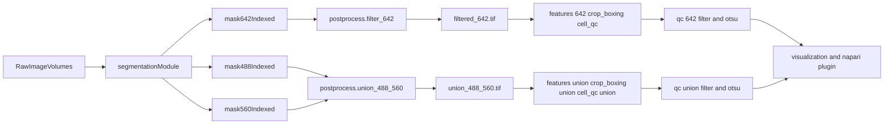

<!-- 609f6395-0019-420c-9af1-a16d214e0705 -->
---
todos:
  - id: "postprocess-union-script"
    content: "Add postprocess/union_488_560_mask.py with pixel-OR + 26-connectivity relabel, --require-both-channels opt-in, and a 4-channel union_488_560_combined.tif writer mirroring filter_642_mask.py."
    status: pending
  - id: "postprocess-tests"
    content: "Add postprocess/tests/test_union_488_560.py covering disjoint blobs, touching blobs, --require-both-channels, dtype escalation, and Z-mismatch truncation."
    status: pending
  - id: "variant-helper"
    content: "Add a single VARIANT_FILES mapping (probably in postprocess/__init__.py) so all downstream consumers resolve mask/combined/cell_boxing/cell_qc/dinov2-bounds names from one place."
    status: pending
  - id: "features-variant"
    content: "Add --variant to features/crop_cells.py, features/extract_features.py, features/compute_dinov2_volume_norm_csv.py, features/extract_dinov2_embeddings.py, features/dinov2/pipeline.py; default filtered_642."
    status: pending
  - id: "qc-variant"
    content: "Add --variant to qc/filter_by_intensity.py and qc/filter_full_z_by_pass_pixel_intensity.py; document the qc/apply_qc_pass_to_label_mask.py invocation for the union mask."
    status: pending
  - id: "orchestrator-flag"
    content: "Add --mask-variant {filtered_642, union_488_560, both} to pipelines/run_analysis_pipeline.py; route postprocess step and forward --variant to downstream stages."
    status: pending
  - id: "docs-update"
    content: "Update postprocess/README.md, MODULE_ARCHITECTURE.md, and pipeline-context.md with the new variant artifacts and orchestrator flag."
    status: pending
  - id: "lsf-job-scripts"
    content: "Add scripts/bsub_union_488_560.sh (runs postprocess/union_488_560_mask.py for ONE sample; standard queue; no email) and scripts/submit_union_488_560_batch.sh (login-node loop, one bsub per image). Mirrors scripts/bsub_check_4_24_25_seg_channels.sh conventions; absolute paths; logs under <output>/<sample>/_lsf_logs/. Downstream variant chain is intentionally out of scope for these scripts."
    status: pending
  - id: "smoke-validate"
    content: "Run --mask-variant both on one sample via bsub (rhel88_gpu if running DINOv2, otherwise standard); confirm filtered_642 and union_488_560 artifacts coexist."
    status: pending
isProject: false
---

# Plan: pixel-level 488 ∪ 560 mask as a coexisting downstream variant

## Motivation

The current downstream "cell" mask is `filtered_642.tif`, produced by [postprocess/filter_642_mask.py](postprocess/filter_642_mask.py). The 642 (DAPI) channel densely labels nuclei, including cells that are not biologically of interest, which makes 642-anchored Cellpose segmentation noisy. The 488 and 560 channels are signal-specific and cleaner. This plan adds a parallel mask product:

- For every pair `(a, b)` of (488-label, 560-label) sharing voxels, compute `IoMin(a, b) = |a ∩ b| / min(|a|, |b|)`.
- Build a bipartite graph with edges where `IoMin >= tau` (default `0.2`); connected components define fused cells.
- Each component gets a contiguous ID `1..K`; a 488 cell with no 560 match keeps its own ID and vice versa.
- Stored as `union_488_560.tif` and `union_488_560_combined.tif`, sitting next to `filtered_642.tif` / `filtered_642_combined.tif`.

Existing 642 path is untouched and remains the default.

## Naming convention (parallel to `filtered_642`)

- Mask volume: `union_488_560.tif` (under sample output root)
- 4-channel intensity+mask stack: `union_488_560_combined.tif` (Z, C, Y, X) with channels `[642, 488, 560, union_mask]` — same layout as `filtered_642_combined.tif` so consumers only need a name swap
- Crops: `cell_boxing_union_488_560/` (and `cell_boxing_full_z_union_488_560/` when `--also-full-z`)
- Per-cell QC table: `cell_qc_union_488_560/qc_features.csv` and `qc_features_filtered.csv`
- Otsu-pass mask: `union_488_560_pass_otsu.tif` (via existing `--mask-name`/`--output-name` in [qc/apply_qc_pass_to_label_mask.py](qc/apply_qc_pass_to_label_mask.py))
- DINOv2 volume-bounds CSV: `dinov2_volume_bounds_union_488_560.csv`

## New code

### 1. `postprocess/union_488_560_mask.py` (new)

Mirrors the structure of [postprocess/filter_642_mask.py](postprocess/filter_642_mask.py). Reads:

- `<output>/488nm_crop/segmentation_3D_masks/488nm_crop_3D_indexed.tif`
- `<output>/560nm_crop/segmentation_3D_masks/560nm_crop_3D_indexed.tif`
- (Originals via `_find_original_volume(...)` for the combined stack — same helper signature as the existing script.)

Core algorithm (IoMin label stitching; preserves Cellpose cell identity):

```python
import numpy as np

# 1) Per-label volumes
vol_488 = np.bincount(m488.ravel())
vol_560 = np.bincount(m560.ravel())

# 2) Sparse pairwise intersections via packed-key np.unique
both = (m488 > 0) & (m560 > 0)
a_arr = m488[both].astype(np.int64); b_arr = m560[both].astype(np.int64)
n560_eff = int(b_arr.max()) + 1
key = a_arr * n560_eff + b_arr
u_keys, u_counts = np.unique(key, return_counts=True)
pair_a = u_keys // n560_eff; pair_b = u_keys % n560_eff

# 3) Bipartite edges where IoMin >= tau
denom = np.minimum(vol_488[pair_a], vol_560[pair_b]).astype(np.float64)
iomin = u_counts / denom
edges = (iomin >= tau)

# 4) Connected components in the bipartite graph (union-find with 488 IDs as
#    1..N488 and 560 IDs as N488+1..N488+N560).
# 5) Sort components by total voxel count -> contiguous IDs 1..K.
# 6) Build lut_488 and lut_560; paint via:
#       out = np.where(lut_488[m488] != 0, lut_488[m488], lut_560[m560])
# 7) Compact relabel + dtype = uint16 if K<=65535 else uint32.
```

CLI flags (mirroring `filter_642_mask.py`):

- `--data-rel` / (`--data-dir` + `--output-dir`)
- `--force` (overwrite)
- `--skip-combined` (skip the 4-channel BigTIFF)
- `--tau FLOAT` (default `0.2`): IoMin threshold for fusing a 488-label with a 560-label.
- `--min-label-voxels INT` (default `0`): drop labels smaller than this from either channel before stitching (guards against tiny spurious fragments).

Tie-breaker: when a voxel has both `m488>0` and `m560>0` and the two labels did **not** fuse (their pair's IoMin was below `tau`), 488 wins and the count is reported as `conflict_voxels` in the per-sample log.

Outputs (with `force` semantics matching the existing helper `_write_filtered_volume_pair`):

- `<output>/union_488_560.tif`
- `<output>/union_488_560_combined.tif` (4 channels, OME BigTIFF)
- (Optional, future) `<output>/union_488_560/segmentation_3D_masks/union_488_560_3D_indexed.tif` — only added if a downstream step ends up needing the channel-style per-sample tree; not required by the consumers below.

### 2. `postprocess/tests/test_union_488_560.py` (new)

Synthetic ZYX arrays validating:

- 488 label fully inside a much larger 560 label → fused into **one** ID (IoMin = 1, while IoU would be small).
- Two disjoint 488 and 560 labels → **two** components.
- 488 over-segmented (two fragments) into one 560 cell → fused into **one** ID (`n_to_m == 1`).
- Two adjacent 488 cells with separate 560 partners → **two** components (the over-merge bug of the old pure-OR + 26-conn algo).
- Sub-`tau` corner overlap → labels stay separate, `conflict_voxels` recorded.
- `--min-label-voxels` drops tiny labels.
- Output dtype escalates to `uint32` when `K > 65535`.
- Output IDs are always contiguous `1..K` even when input Cellpose IDs have gaps.
- Background (`m488==0 and m560==0`) stays `0`.

## Modify existing scripts to accept a mask variant

All edits are additive: a new `--variant` flag (default `filtered_642`) selects file names. The default `filtered_642` path is byte-for-byte unchanged.

Define the lookup once (e.g. in [postprocess/__init__.py](postprocess/__init__.py) or a tiny helper module):

```python
VARIANT_FILES = {
    "filtered_642": {
        "mask": "filtered_642.tif",
        "combined": "filtered_642_combined.tif",
        "cell_box": "cell_boxing",
        "cell_box_full_z": "cell_boxing_full_z",
        "cell_qc": "cell_qc",
        "dinov2_bounds": "dinov2_volume_bounds.csv",
    },
    "union_488_560": {
        "mask": "union_488_560.tif",
        "combined": "union_488_560_combined.tif",
        "cell_box": "cell_boxing_union_488_560",
        "cell_box_full_z": "cell_boxing_full_z_union_488_560",
        "cell_qc": "cell_qc_union_488_560",
        "dinov2_bounds": "dinov2_volume_bounds_union_488_560.csv",
    },
}
```

Files to update with an `--variant` flag (+ docstring):

- [features/crop_cells.py](features/crop_cells.py)
  - Replace hardcoded `filtered_642.tif`, `filtered_642_combined.tif`, `cell_boxing`, `cell_boxing_full_z` (lines 144–158, 157–158) with the variant lookup.
  - Adjust [features/crop_cells.py](features/crop_cells.py)'s `_find_unfiltered_mask` to fall back to the union mask itself when variant is `union_488_560` (each union label is its own cell ID, so neighbor stats degenerate to "isolated"), or accept `--unfiltered-mask` to supply one explicitly.
- [features/extract_features.py](features/extract_features.py)
  - Swap hardcoded `cell_boxing` (line 89) for `VARIANT_FILES[variant]["cell_box"]`; outputs go to `VARIANT_FILES[variant]["cell_qc"]`.
- [features/compute_dinov2_volume_norm_csv.py](features/compute_dinov2_volume_norm_csv.py) (line 64) and [features/dinov2/pipeline.py](features/dinov2/pipeline.py) (line 63), [features/extract_dinov2_embeddings.py](features/extract_dinov2_embeddings.py) (CLI doc and any combined-tif resolution): take the combined-tif name from the variant.
- [qc/filter_by_intensity.py](qc/filter_by_intensity.py): operate on `VARIANT_FILES[variant]["cell_qc"]` directory.
- [qc/apply_qc_pass_to_label_mask.py](qc/apply_qc_pass_to_label_mask.py): no source change required; orchestrator passes `--mask-name union_488_560.tif --output-name union_488_560_pass_otsu.tif`.
- [qc/filter_full_z_by_pass_pixel_intensity.py](qc/filter_full_z_by_pass_pixel_intensity.py): take variant for symmetry.

## Orchestrator changes — `pipelines/run_analysis_pipeline.py`

Add one flag and let it drive the chain:

- `--mask-variant {filtered_642, union_488_560, both}` (default `filtered_642`, preserves current behavior).

Behavior:

- `filtered_642` (default): no change to current chain.
- `union_488_560`: replace the `postprocess.filter` step with `postprocess/union_488_560_mask.py`; pass `--variant union_488_560` to `postprocess.combine`, `features.crop`, `features.extract`, `qc.filter`, and the DINOv2 steps.
- `both`: run the full default chain, then re-run the postprocess+downstream subset for `union_488_560` (the segmentation step is shared).

Pseudocode in [pipelines/run_analysis_pipeline.py](pipelines/run_analysis_pipeline.py):

```python
variants = {
    "filtered_642": ["filtered_642"],
    "union_488_560": ["union_488_560"],
    "both": ["filtered_642", "union_488_560"],
}[args.mask_variant]

for v in variants:
    if v == "filtered_642":
        _run("postprocess.filter", ["postprocess/filter_642_mask.py", *passthrough])
    else:
        _run("postprocess.union", ["postprocess/union_488_560_mask.py", *passthrough])
    _run("features.crop",    ["features/crop_cells.py",    "--variant", v, *crop_passthrough])
    _run("features.extract", ["features/extract_features.py", "--variant", v, *passthrough])
    _run("qc.filter",        ["qc/filter_by_intensity.py", "--variant", v, *passthrough])
    if run_dinov2:
        _run("features.dinov2", ["features/extract_dinov2_embeddings.py", "--variant", v, *passthrough, *dinov2_extra])
```

## Documentation updates

- [postprocess/README.md](postprocess/README.md): describe the two postprocess products (anchor-642 vs union-488-560), trade-offs (642 noisy in dense regions; union may merge touching cells in 488/560).
- [MODULE_ARCHITECTURE.md](MODULE_ARCHITECTURE.md): add a note that postprocess can emit one of two interchangeable downstream mask products.
- [pipeline-context.md](pipeline-context.md): add `union_488_560*.tif` to "On-disk conventions" and the new orchestrator flag.

## Pipeline flow (with new branch)



## Out of scope (explicit non-goals)

- Watershed splitting of within-channel touching cells (each Cellpose label stays one indivisible unit).
- Hungarian / mutual-best-match alternative pairing — current proposal is bipartite-CC, which is the most permissive interpretation within the `tau` threshold and tends to fuse over-segmented fragments back together.
- Morphological cleanup (opening / area filters) of the union foreground.
- Touching the segmentation step itself; this is purely a postprocess+downstream addition.

## Execution: LSF submission for `postprocess/union_488_560_mask.py` (one job per image)

Scope: these LSF scripts run **only** the new postprocess step (`postprocess/union_488_560_mask.py`) per sample. The variant-aware downstream chain (crop / features / qc / DINOv2) is a separate topic and is **not** invoked here.

Per `.cursor/rules/lsf-no-login-compute.mdc`: never run this on the login node. Submit each sample as its own `bsub` job to queue `standard` (CPU-only; no GPU needed for the union + connected components step), with **no email** (omit `#BSUB -B` / `#BSUB -N`).

Two new scripts under `scripts/`, following the preamble pattern in `scripts/bsub_check_4_24_25_seg_channels.sh` and `segmentation_multiscale_cellpose_3D/scripts/bsub_intensity_filter.sh` (conda activate, `LS_SUBCWD`/`LS_EXECCWD`/`PROJECT_ROOT` resolution so paths work from the LSF spool directory, per-sample log under `_lsf_logs/`).

### `scripts/bsub_union_488_560.sh` (one sample, one job)

```bash
#!/usr/bin/env bash
# LSF: postprocess/union_488_560_mask.py for ONE sample.
# Standard queue, CPU-only. No email (no #BSUB -B / -N).
#
# Submit:
#   CMAP_DATA_REL="4_24_25_CGN_6_10_2/Sample10_Position0_decon_dsr" \
#     bsub < scripts/bsub_union_488_560.sh
#
# Optional:
#   CMAP_UNION_EXTRA_ARGS  (e.g. "--require-both-channels --skip-combined")

#BSUB -J union488560
#BSUB -q standard
#BSUB -n 1
#BSUB -R "rusage[mem=16000] span[hosts=1]"
#BSUB -W 60

set -euo pipefail
eval "$(conda shell.bash hook)"
conda activate cmap

if [[ -n "${LS_SUBCWD:-}" ]]; then
  PROJECT_ROOT="$(cd "$LS_SUBCWD" && pwd)"
elif [[ -n "${LS_EXECCWD:-}" ]]; then
  PROJECT_ROOT="$(cd "$LS_EXECCWD" && pwd)"
else
  PROJECT_ROOT="$(cd "$(dirname "${BASH_SOURCE[0]}")/.." && pwd)"
fi
cd "$PROJECT_ROOT" || exit 1

[[ -z "${CMAP_DATA_REL:-}" ]] && { echo "Set CMAP_DATA_REL" >&2; exit 1; }

OUTPUT_ROOT="${PIPELINE_OUTPUT_DIR:-$PROJECT_ROOT/output}"
LOG_DIR="${OUTPUT_ROOT}/${CMAP_DATA_REL}/_lsf_logs"
mkdir -p "$LOG_DIR"
exec >"${LOG_DIR}/union_488_560_${LSB_JOBID:-manual}.out" 2>&1

echo "Job ${LSB_JOBID:-?} $(date -Is)"
echo "CMAP_DATA_REL=${CMAP_DATA_REL}"

# shellcheck disable=SC2086
python3 -u "${PROJECT_ROOT}/postprocess/union_488_560_mask.py" \
  --data-rel "$CMAP_DATA_REL" \
  --force \
  ${CMAP_UNION_EXTRA_ARGS:-}
```

### `scripts/submit_union_488_560_batch.sh` (one bsub per image)

Login-node-safe: it only enumerates sample dirs and calls `bsub` per sample (no compute on login).

```bash
#!/usr/bin/env bash
# Submit one union_488_560 LSF job per sample under a dataset root.
# Usage:
#   CMAP_DATASET="4_24_25_CGN_6_10_2" bash scripts/submit_union_488_560_batch.sh
# Optional:
#   PIPELINE_OUTPUT_DIR     (default: <repo>/output)
#   CMAP_UNION_EXTRA_ARGS   (forwarded to union_488_560_mask.py)

set -euo pipefail
PROJECT_ROOT="$(cd "$(dirname "${BASH_SOURCE[0]}")/.." && pwd)"
OUTPUT_ROOT="${PIPELINE_OUTPUT_DIR:-$PROJECT_ROOT/output}"
DATASET="${CMAP_DATASET:?Set CMAP_DATASET (e.g. 4_24_25_CGN_6_10_2)}"

shopt -s nullglob
count=0
for sample_dir in "${OUTPUT_ROOT}/${DATASET}"/*/; do
  sample="$(basename "$sample_dir")"
  # Require both per-channel indexed masks (inputs to the union step).
  [[ -f "${sample_dir}/488nm_crop/segmentation_3D_masks/488nm_crop_3D_indexed.tif" ]] || continue
  [[ -f "${sample_dir}/560nm_crop/segmentation_3D_masks/560nm_crop_3D_indexed.tif" ]] || continue
  echo "Submitting: ${DATASET}/${sample}"
  CMAP_DATA_REL="${DATASET}/${sample}" \
  CMAP_UNION_EXTRA_ARGS="${CMAP_UNION_EXTRA_ARGS:-}" \
    bsub -J "u488560_${sample}" < "${PROJECT_ROOT}/scripts/bsub_union_488_560.sh"
  count=$((count + 1))
done
echo "Submitted ${count} job(s). Monitor: bjobs -w"
```

Key points:
- Runs **only** `postprocess/union_488_560_mask.py`. Crop / features / qc / DINOv2 are out of scope here (separate plan / scripts).
- Queue **`standard`** (CPU-only; the union step is pixel-OR + 3D connected components, no GPU).
- **No email**: `#BSUB -B` / `#BSUB -N` deliberately omitted.
- **One bsub per image**: the batch launcher submits a fresh `bsub` per sample directory (no job arrays), so failures are isolated per image.
- **Absolute paths** to the repo script (`$PROJECT_ROOT/postprocess/union_488_560_mask.py`) and data — required because LSF runs from a spool cwd.
- Per-job log: `<output>/<sample>/_lsf_logs/union_488_560_<jobid>.out`.

---

## Validation steps (post-implementation)

1. Unit tests under `postprocess/tests/test_union_488_560.py` pass.
2. On one sample (e.g. `4_24_25_CGN_6_10_2/Sample10_Position0_decon_dsr`), run `python pipelines/run_analysis_pipeline.py --mask-variant both --skip-segmentation --passthrough --data-rel 4_24_25_CGN_6_10_2/Sample10_Position0_decon_dsr` on `rhel88_gpu` (DINOv2) or `standard` (no DINOv2) per `.cursor/rules/lsf-no-login-compute.mdc` — never on the login node.
3. Confirm that the `filtered_642` artifacts and `union_488_560` artifacts coexist under the same sample output dir and that napari can load either via the existing root.
