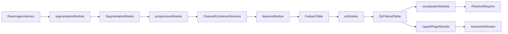

# CMAP Module Architecture

The workspace is organized as sibling modules under `cmap/`.

- `segmentation/`: raw image input -> segmentation masks
- `postprocess/`: mask filtering and merged mask+intensity outputs
- `features/`: cell crops and feature extraction
- `qc/`: feature-level filtering and pass/fail decisions
- `visualization/`: embeddings and plots
- `napari-plugin/`: interactive review workflows
- `pipelines/`: orchestrators that call module CLIs
- `shared/`: cross-module utilities
- `archive/legacy_modules/`: archived legacy segmentation projects (not active)

## Flowchart

## Transitional Note

`segmentation/`, `postprocess/`, `features/`, `qc/`, and `visualization/` now
run natively under their new top-level module folders (copy-first migration
with minimal path edits).
