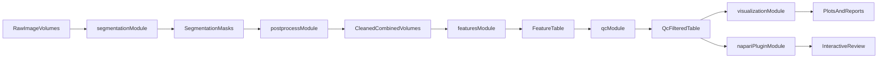

# CMAP Module Architecture

The workspace is organized as sibling modules under `cmap/`.

- `segmentation/`: raw image input -> segmentation masks
- `postprocess/`: mask filtering and merged mask+intensity outputs
- `features/`: cell crops and feature extraction
- `qc/`: feature-level filtering and pass/fail decisions
- `visualization/`: embeddings and plots
- `napari-plugin/`: interactive review workflows
- `pipelines/`: orchestrators that call module CLIs
- `shared/`: cross-module utilities
- `archive/legacy_modules/`: archived legacy segmentation projects (not active)

## Flowchart

```mermaid
flowchart LR
rawImages[RawImageVolumes] --> segmentationModule[segmentationModule]
segmentationModule --> segmentationMasks[SegmentationMasks]

segmentationMasks --> postprocessModule[postprocessModule]
postprocessModule --> cleanedVolumes[CleanedCombinedVolumes]

cleanedVolumes --> featuresModule[featuresModule]
featuresModule --> featureTable[FeatureTable]

featureTable --> qcModule[qcModule]
qcModule --> qcTable[QcFilteredTable]

qcTable --> visualizationModule[visualizationModule]
qcTable --> napariPluginModule[napariPluginModule]
visualizationModule --> plotsReports[PlotsAndReports]
napariPluginModule --> interactiveReview[InteractiveReview]
```

## Optional: DINOv2 deep embeddings

`features/dinov2/` adds an optional frozen DINOv2 ViT-B/14 (2.5D) encoder
that produces a 768-D vector per cell from the existing
`cell_boxing/cell_*.tif` crops. It is wired into the orchestrator behind
`pipelines/run_analysis_pipeline.py --run-dinov2` (and
`--run-dinov2-vis` for the pooled UMAP step under `cell_qc_all/`). See
`features/dinov2/README.md` for details.

## Transitional Note

`segmentation/`, `postprocess/`, `features/`, `qc/`, and `visualization/` now
run natively under their new top-level module folders (copy-first migration
with minimal path edits).
